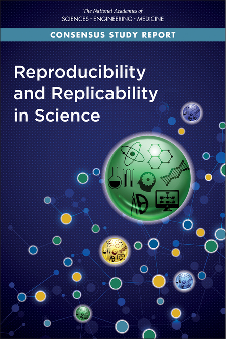

## Agenda

1. Discuss Center data goals (e.g. [reproducible project managment](https://journals.plos.org/plosone/article?id=10.1371/journal.pone.0212390)) (30 min)
    - Overall data framework
    - Uniform data collection tools
    - Data management
    - Data sources
    - Data analysis
    - Data sharing
    
2. Hands-on workshop and R "onramp" (60 min)

## Reproducibility and Replicability in Science



[Link to report](https://www.nationalacademies.org/our-work/reproducibility-and-replicability-in-science)

## NASEM Definitions (2019) {.build}

### Reproducibility

>"obtaining consistent results using the same input data, computational steps, methods, and conditions of analysis"

### Replicability

>"obtaining consistent results across studies aimed at answering the same scientific question, each of which has
obtained its own data"

["BD2K": Big Data to Knowledge](https://commonfund.nih.gov/bd2k)

## Overall data framework

1. Data collection 
    - Sources and collection methods
2. Data management 
    - [Findable, Accessible, Interoperable, Reusable, Ethical, Reproducible (FAIR(ER)) Principles](https://www.nature.com/articles/sdata201618)
3. Data analysis 
    - [Code review](https://ropensci.org/blog/2017/09/01/nf-softwarereview/), collaboration, generalizable
4. Data sharing 
    - Visualizations, API key, App platforms, Web tracking

## Uniform data collection tools

1. Text message questionnaires 
    - [REDCap](https://www.project-redcap.org/)  
2. Online survey or time series questionnaires 
    - [REDCap](https://www.project-redcap.org/)  
3. Other survey tools  
    - [Qualtrics](https://www.qualtrics.com/lp/qualtrics-demo/?utm_source=google&utm_medium=ppc&utm_campaign=US-Brand-Qualtrics-Brand&utm_keyword=qualtrics&MatchType=e&adid=178143128566&utm_content=178143128566&adgroupid=41339289338&campaignid=755409789&AdGroup={AdGroup}&BidMatchType={BidMatchType}&Target=&targetid=kwd-8232955280&Device=c&devicemodel=&loc_phsyical_ms=9033307&Placement=&querystring={querystring}&network=g&adposition=&GCLID=Cj0KCQjwuL_8BRCXARIsAGiC51Aab4Dm1yeGdQLAV3t7KDRabiZeIWyUylck4aZuKPFPINmVs3YgHAwaAmppEALw_wcB&gclid=Cj0KCQjwuL_8BRCXARIsAGiC51Aab4Dm1yeGdQLAV3t7KDRabiZeIWyUylck4aZuKPFPINmVs3YgHAwaAmppEALw_wcB)  
    - [ODK](https://getodk.org/)  
4. Automated, reproducible and trackable QA/QC procedures for exposure data  

## Data management

1. Raw data $\rightarrow$ publication
2. Extension of "chain of custody" for samples

## Data sources

1. Visit [AFF Health Indicators](https://github.com/eddiekasner/aghealthindicators#ag-health-indicators) to explore datasets for [burden, need, impact](https://www.cdc.gov/niosh/programs/bni.html)
2. Please add data sources (via GitHub or ejkasner@uw.edu), especially for:
    - Forestry, Fishing
    - Oregon, Idaho, Alaska

## Data analysis

1. Develop collaborative code development tools (GitHub?)
2. Develop systems for code review
3. Develop functions and tools that can be generalized and shared

## Hands-on workshop

1. Introduction to R and RStudio
    - Option 1: Use the SPH maintained RStudio server
        - https://rstudio.sph.washington.edu/  
    - Option 2: Install R and RStudio onto your personal computer
    
2. Obtain and analyze data from an online source
    - Example Quarterly Workforce Indicator Data

3. Develop a [data dashboard] (https://rmarkdown.rstudio.com/flexdashboard/)

## Reflection (3 mins)

Click through to [this google doc](https://docs.google.com/document/d/1nVsgpdX4GBpLg84OXuzplmNWjwHp_CaszOUOQAR8jaE/edit?usp=sharing) and share your thoughts:

1. What seems doable on your team now? in 1 year? in 5 years?
2. What seems doable for the center now? in 1 year? in 5 years?
3. Pitfalls to avoid in this work?
4. Other ideas sparked?

## Resources

- Eddie Kasner (ejkasner@uw.edu)
    - https://github.com/eddiekasner/aghealthindicators#aff-health-indicators
    - https://github.com/eddiekasner/PNASHR-Workshop
- Elena Austin (elaustin@uw.edu)
    - https://github.com/elaustin/Ag-Health-Indicators 
    - R code and visualization examples
- Brian High (high@uw.edu)
    - https://github.com/brianhigh/computing_bootcamp/tree/master/R#introduction-to-r-rstudio-markdown-and-git  
    - Support with R, R Studio, and Git (Github)
- [UW DEOHS Coding Community of Practice](https://github.com/deohs/coders#coders)

## Workshop

* What R is (and isn't)
* Why R is so popular
* What RStudio is and isn't
* Reasons to use RStudio
* How to use RStudio

## What is R?

* R is a cross-platform software **_application_** for data analysis and visualization
* R is **_free_** to use, **_free_** to share, and **_free_** to modify
* R is a programming **_language_** with over 10,000 user-contributed packages
* R is an open source and **_community_**-driven software development **_project_**

## What R isn't

* R is not a point-and-click software application (though some are available for R)
* R is not a proprietary commercial product (though some do sell it)
* R is not something you can master in a day (or a week, or a month)

## Why R is so popular

* It is free
* Support from a very helpful community of thousands of users
* Available code or packages which are only available in R
* Ability to generate quality graphics for publication
* Supports data analysis "best practices"
* End-to-end solution for reproducible data analysis
* Capable of handling "Big Data"

## What RStudio is and isn't

### RStudio is:

* A full-featured, cross-platform, open source application for working with R
* A graphical user interface (GUI) for working with R

### RStudio isn't:

* A point-and-click spreadsheet app (like Excel)
* A point-and-click plotting app (like Tableau)
* A text-only command-line utility (but it includes a text Console)
* An R language interpreter (as R is installed as a separate app)

## Why use RStudio?

* It is a user-friendly way to use R
    - The interface feels familiar to many people  
    - Integrates common data analysis workflows
* You can use it for free on most computer systems
* It is very popular, so your collaborators may already be using it
* Very few alternatives (R-GUI, JGR, Visual Studio) are as full-featured
* It performs well, is designed well, and is backed by a respected company

We are going to gear our instruction towards the use of RStudio and will not 
be covering the other alternatives.

## Ways to use RStudio

### RStudio Server accessed through a web browser

* Easier to learn and teach on because it's centrally managed by IT.
* SPH runs an RStudio Server on "rstudio.sph" for use by all UW SPH departments.
   - Link: [https://rstudio.sph.washington.edu/](https://rstudio.sph.washington.edu/)
   - Free for SPH affiliates (students, staff, faculty, postdocs, etc.) to use. 
   - Requires UW NetID.
* DEOHS runs an RStudio Server for use by DEOHS.
   - Link: [https://plasmid.deohs.washington.edu/](https://plasmid.deohs.washington.edu/)
   - Free for DEOHS affiliates (students, staff, faculty, postdocs, etc.) to use. 
   - Requires UW NetID and DEOHS account.
   - Access directly from UW Campus or remotely through [Husky OnNet VPN](https://itconnect.uw.edu/connect/uw-networks/about-husky-onnet/).
   - Easily access your departmental storage (i.e., network "drives").
* This "onramp" is geared towards using RStudio Server, but any RStudio will work.

## Ways to use RStudio

### RStudio Cloud

[Rstudio Cloud](https://rstudio.cloud/) is a internet-based option to run Rstudio: [https://rstudio.cloud/](https://rstudio.cloud/). 

Eliminates hardware and software configuration and management required when running R & RStudio locally.

Requires

* Internet connection & browser
* Account sign-up

Free for individual use with some restrictions (e.g. number of projects, memory), 
and has paid subscription upgrade.

## Ways to use RStudio

### Download and run locally

* The RStudio Desktop application is available for free on the [internet](https://www.rstudio.com/products/rstudio/download/).
* We will not focus on local installation or use during this introductory onramp,
but some instructions are at the end of this presentation.

## How to install R and RStudio desktop

We will not be spending time on local installations of R and RStudio during this introductory onramp. These instructions are here for reference if needed:

1. [Download](https://cran.r-project.org/banner.shtml) the latest
   **_installer_** version of **_R_** available for your operating system.
     - Run the installer (usually by double-clicking on the installer's icon).
     - Click through the installer's prompts accordingly. The defaults are       
       usually fine.
2. [Download](https://www.rstudio.com/products/rstudio/download/) the latest
   **_installer_** version of **_RStudio Desktop_** available for your 
   operating system.
     - Run the installer (usually by double-clicking on the installer's icon).
     - Click through the installer's prompts accordingly. The defaults are       
       usually fine.
3. You may remove the installers when you have confirmed that RStudio is 
   installed correctly and launches without error.
   
## Using R within RStudio

1. If there is a file open, it will appear in the upper-left ("Source") pane
2. The session information will be found in the upper-right ("Environment") pane
3. The "Viewer" pane with tabs for files, Plots, Help, etc. is in the 
   lower-right
4. The interactive R prompt ("Console") will appear in the left or lower-left pane


## Open a file

In RStudio, start a new Project:

1. File > New Project > Version Control > Git. 
2. In the “repository URL” paste the URL of this workshop https://github.com/eddiekasner/PNASHR-Workshop
3. Select a folder directory for your local machine
4. Look in RStudio’s file browser pane for workshop contents

## Open your first R Script

1. Navigate to the Workshop content in your "File Viewer" pane
2. Click the file called "My First R Script.R"

## Set up a script file

Start your code with a header describing this code.


```r
######################################
# Description: My first code
# Author: Elena Austin
# Date: October 2020
# Version: 1
######################################
```

## Section 1 R Syntax

Syntax in a programming language represents the fundamental rules of a programming language. 

**Base R syntax** The example below shows some important elements of R syntax.

* Special character **<-** assigns values to a variable. 
* You will notice the use of parentheses in R. The round parentheses **()** are used to denote the beginning and end of the inner elements, or arguments, of a function. 
* In this case, the function is called *c*. To learn more type ?c in your console window.


```r
# Create variables

my_lucky_number <- 5
my_name <- "Elena"
my_favorite_ice_cream <- c("chocolate", "vanilla", "maple")
```

2. To run a line of code put your cursor on that line and press the "run" button OR hit ctrl + enter on the keyboard. You can highlight chunks of code to run multiple lines. 

3. Note that special R packages extend the basic syntax of R. 

## Using packages 

1. R has an active user base who contribute new routines or *packages* to extend capabilities.

2. To use these packages they must be 

* Downloaded and installed
* Loaded into R

Unless you alter how R is opened, you must load the libraries you wish to use within your R script.


```r
# Check that pacman is installed
if (!require("pacman")) 
  install.packages("pacman", repos = "https://cloud.r-project.org") 

# Load package to create descriptive table
pacman::p_load(table1)
```

## Loading and importing data

1. Data must be formatted and ready to be imported in R. Formats that are import ready include comma separated values (CSV) lists.
2. Data imports from excel are possible if data is correctly formatted
3. Connections to databases and web sources are possible


```r
# Read CSV
mydata <- read.csv("Data/testdata.csv")
```


```r
# Generate table1
table1( ~ Petal.Width + Petal.Length | Species, data = mydata)
```

<!--html_preserve--><div class="Rtable1"><table class="Rtable1">
<thead>
<tr>
<th class='rowlabel firstrow lastrow'></th>
<th class='firstrow lastrow'><span class='stratlabel'>setosa<br><span class='stratn'>(N=50)</span></span></th>
<th class='firstrow lastrow'><span class='stratlabel'>versicolor<br><span class='stratn'>(N=50)</span></span></th>
<th class='firstrow lastrow'><span class='stratlabel'>virginica<br><span class='stratn'>(N=50)</span></span></th>
<th class='firstrow lastrow'><span class='stratlabel'>Overall<br><span class='stratn'>(N=150)</span></span></th>
</tr>
</thead>
<tbody>
<tr>
<td class='rowlabel firstrow'><span class='varlabel'>Petal.Width</span></td>
<td class='firstrow'></td>
<td class='firstrow'></td>
<td class='firstrow'></td>
<td class='firstrow'></td>
</tr>
<tr>
<td class='rowlabel'>Mean (SD)</td>
<td>0.246 (0.105)</td>
<td>1.33 (0.198)</td>
<td>2.03 (0.275)</td>
<td>1.20 (0.762)</td>
</tr>
<tr>
<td class='rowlabel lastrow'>Median [Min, Max]</td>
<td class='lastrow'>0.200 [0.100, 0.600]</td>
<td class='lastrow'>1.30 [1.00, 1.80]</td>
<td class='lastrow'>2.00 [1.40, 2.50]</td>
<td class='lastrow'>1.30 [0.100, 2.50]</td>
</tr>
<tr>
<td class='rowlabel firstrow'><span class='varlabel'>Petal.Length</span></td>
<td class='firstrow'></td>
<td class='firstrow'></td>
<td class='firstrow'></td>
<td class='firstrow'></td>
</tr>
<tr>
<td class='rowlabel'>Mean (SD)</td>
<td>1.46 (0.174)</td>
<td>4.26 (0.470)</td>
<td>5.55 (0.552)</td>
<td>3.76 (1.77)</td>
</tr>
<tr>
<td class='rowlabel lastrow'>Median [Min, Max]</td>
<td class='lastrow'>1.50 [1.00, 1.90]</td>
<td class='lastrow'>4.35 [3.00, 5.10]</td>
<td class='lastrow'>5.55 [4.50, 6.90]</td>
<td class='lastrow'>4.35 [1.00, 6.90]</td>
</tr>
</tbody>
</table>
</div><!--/html_preserve-->

## Regression analysis: Fit

1. Data analysis can be performed including regression modeling.
2. This example highlights methods to neatly output regression results. 


```r
# Regression
fit <- lm(Petal.Width ~ Petal.Length, data = mydata)
class(fit)
```

```
## [1] "lm"
```

## Regression analysis: Summary

You can view the regression summary with `summary()`.


```r
summary(fit)
```

```
## 
## Call:
## lm(formula = Petal.Width ~ Petal.Length, data = mydata)
## 
## Residuals:
##      Min       1Q   Median       3Q      Max 
## -0.56515 -0.12358 -0.01898  0.13288  0.64272 
## 
## Coefficients:
##               Estimate Std. Error t value Pr(>|t|)    
## (Intercept)  -0.363076   0.039762  -9.131  4.7e-16 ***
## Petal.Length  0.415755   0.009582  43.387  < 2e-16 ***
## ---
## Signif. codes:  0 '***' 0.001 '**' 0.01 '*' 0.05 '.' 0.1 ' ' 1
## 
## Residual standard error: 0.2065 on 148 degrees of freedom
## Multiple R-squared:  0.9271,	Adjusted R-squared:  0.9266 
## F-statistic:  1882 on 1 and 148 DF,  p-value: < 2.2e-16
```

## Regression analysis: Plot


```r
par(mfrow=c(2,2))
plot(fit)
```

<!-- -->

## Regression output {.smaller .vcenter }

Regression output can be easily formatted for publication or using packages such as stargazer. 


```r
# Make regression output pretty (can generate LaTeX and html output)
pacman::p_load(stargazer)
stargazer(fit, type = 'html')
```


<table style="text-align:center"><tr><td colspan="2" style="border-bottom: 1px solid black"></td></tr><tr><td style="text-align:left"></td><td><em>Dependent variable:</em></td></tr>
<tr><td></td><td colspan="1" style="border-bottom: 1px solid black"></td></tr>
<tr><td style="text-align:left"></td><td>Petal.Width</td></tr>
<tr><td colspan="2" style="border-bottom: 1px solid black"></td></tr><tr><td style="text-align:left">Petal.Length</td><td>0.416<sup>***</sup></td></tr>
<tr><td style="text-align:left"></td><td>(0.010)</td></tr>
<tr><td style="text-align:left"></td><td></td></tr>
<tr><td style="text-align:left">Constant</td><td>-0.363<sup>***</sup></td></tr>
<tr><td style="text-align:left"></td><td>(0.040)</td></tr>
<tr><td style="text-align:left"></td><td></td></tr>
<tr><td colspan="2" style="border-bottom: 1px solid black"></td></tr><tr><td style="text-align:left">Observations</td><td>150</td></tr>
<tr><td style="text-align:left">R<sup>2</sup></td><td>0.927</td></tr>
<tr><td style="text-align:left">Adjusted R<sup>2</sup></td><td>0.927</td></tr>
<tr><td style="text-align:left">Residual Std. Error</td><td>0.206 (df = 148)</td></tr>
<tr><td style="text-align:left">F Statistic</td><td>1,882.452<sup>***</sup> (df = 1; 148)</td></tr>
<tr><td colspan="2" style="border-bottom: 1px solid black"></td></tr><tr><td style="text-align:left"><em>Note:</em></td><td style="text-align:right"><sup>*</sup>p<0.1; <sup>**</sup>p<0.05; <sup>***</sup>p<0.01</td></tr>
</table>

## Advanced data manipulation

* We will begin to consider some advanced data manipulations within R.

* In this example, we will download the dataset of severe injuries reported to OSHA between 2015 and 2020 directly from the OSHA website.

* The remainder of the workshop will take place interactively within the script file titles "severe_injury.R". 

* For additional examples see
  * [Interactive Injury Dashboard](https://github.com/elaustin/Ag-Health-Indicators/tree/master/Injury%20Data%20WA) 
  * [Interactive Calibration Dashboard](https://github.com/elaustin/calibration_dashboard)
  
* Get support
  * [DEOHS Coders Group](https://portal.deohs.washington.edu/node/1978)
  * [Helpful Online Resources](https://support.rstudio.com/hc/en-us/articles/200552336-Getting-Help-with-R)
